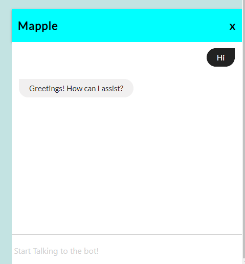
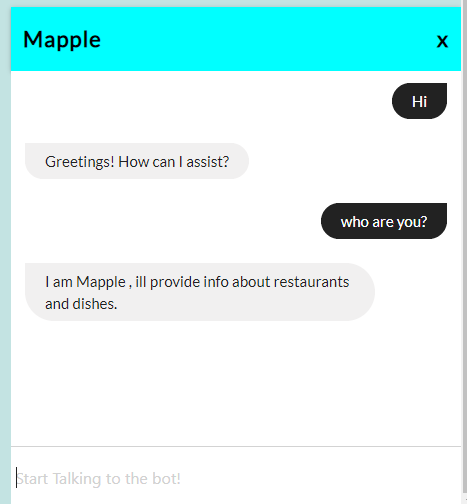
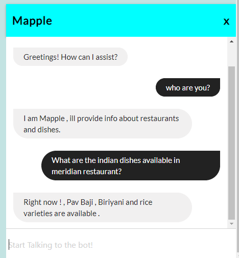
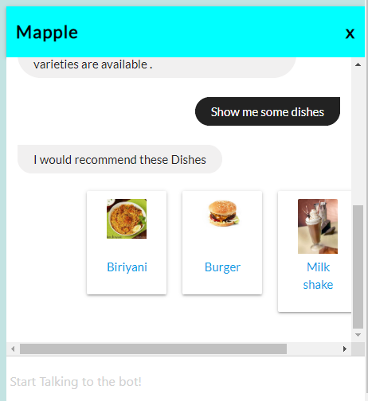

# Food-Assistant 

## Mapple

A Food ChatBot developed using DialogFlow [chatbot development framework] from google cloud platform.
Mapple chatbot provides users with Restaurant and dish information with AI enabled Quick reply functionality from dialogFlow, which makes the conversation more pleasant. 

## Author: 

  #### <a href="https://github.com/guruk05">Guru Prasath</a>
  #### <a href="https://github.com/SudheerReddySingam">Sudheer Reddy</a>
  
## Developed Using:

 #### * <a href="https://reactjs.org/"> React Js </a> 
 #### * <a href="https://nodejs.org/en/"> Node JS </a> 
 #### * <a href="https://expressjs.com/"> Express JS </a>
* ####  <a href="https://www.mongodb.com/"> MongoDb </a>
 
## Preview:

  
  
  
  
  
  
  
  
  
  
  
  
  
## Developed to Chat !
