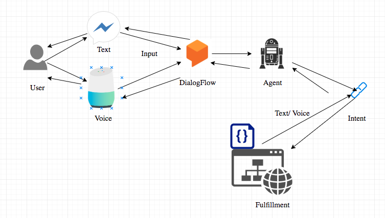

# Food-Assistant 

## Mapple

A Food ChatBot developed using Mern Full Stack Technology DialogFlow [chatbot development framework] from google cloud platform.
Mapple chatbot provides users with Restaurant and dish information with AI enabled Quick reply functionality from dialogFlow, which makes the conversation more pleasant. 
  
## Developed Using:

* ####  <a href="https://dialogflow.com/"> DialogFlow </a>
* ####  <a href="https://reactjs.org/"> React Js </a> 
* ####  <a href="https://nodejs.org/en/"> Node JS </a> 
* ####  <a href="https://expressjs.com/"> Express JS </a>
* ####  <a href="https://www.mongodb.com/"> MongoDb </a>

## DialogFlow 

DialogFlow Offers human interaction technologies which is powered by Artificial Intelligence, NLP and NLU. By using dialogFlow customized chatbots for websites, android and ios can be built. Assistants similar to Google assistants and any type of service that involves users interaction is also possible using DialogFlow.

 
 
## Preview:

  
  
  
  
  
  
  
  
  
  
  
 ## Authors: 

 * #### <a href="https://github.com/guruk05">Guru Prasath</a>
 * #### <a href="https://github.com/SudheerReddySingam">Sudheer Reddy</a> 
  
## Developed to Chat !
